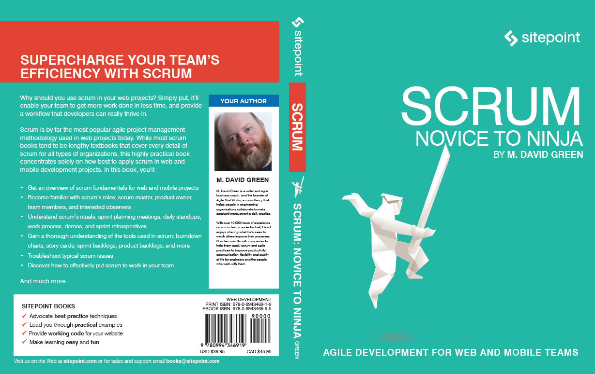

# View3d - Making all your Ds 3.

This module renders any flat, single-piece, cover graphic into a 3d posable model using HTML, CSS & a little JS. It's ideal for dynamic book renderings, but useful for displaying any DVD boxes, Blu-rays, Video Game packaging, software boxes, matchboxes or _any_ other essentially cubic object.


Play with the Codepen demo here: http://codepen.io/alexmwalker/pen/EyPVLd

## Basic HTML 

This is the basic HTML structure for each book graphic. 

```html
    <div class="book size-mid">
        <div class="cover">
            
        </div>
    </div>
```

At their simplest, all books should render square and flat with a simple shadow. The `.book` class is the frame to place into your layout. Currently `.book` is the only 'top-level' object class, but ultimately classes like `.dvd` and `.xbox` would exist to render edges and proportions for those media types. 

The `.cover` class works to mask the IMG down to the front only. Yes, we *could* use `clip: rect` here, but this old-school method ensures older and less sophisticated devices at least get a clean, clipped result.

Three sizes are available `.size-small`, `.size-mid` and `.size-large`. These dimensions are set in the SASS variables. 
```html
    <div class="book size-small">
        <div class="cover">
            ...
 ```           
Adding `.view3d` allows the 3D CSS to be applied to the group, though the book will still be presented square until a 'posing' class is added.
```html
    <div class="book size-mid view3d">
        <div class="cover">
            ...
```  
### Posing Classes

Posing classes are used to rotate and position the 3d model. These classes have no effect without the presense of the `.view3d` class. 
```css
    <div class="book size-mid view3d oclock-2">
        <div class="cover">
            ...
```

#### Tick Tock 

I'm using an 'analog clock-centric' CSS class system to provide a half dozen basic rotated 'poses'. In this system, the viewer stands at 12 o'clock and the model is placed in the middle of the clock. If the `.oclock-12` class is applied to the book, the book will face directly at the viewer (or with no posing class present, as this is the default).

             +------------+
             |   Viewer   |
             +------------+
                   12
              11        1
          10       ^        2
                   |
         9         |         3
               +-model-+
          8        +        4
        
              7         5
                   6
        
        +----------------------+
        |  Class = '.clock-12' |
        +----------------------+

The `.oclock-6` class show the viewer the reverse side of the model.

Of course, you're welcome to create your own poses to suit the product and layout you're working with.

Lastly you can choose to make the model react to the mouse by adding the `.hover` class. Currently, this will zoom the model slightly before slowly rotating it. 
```css
    <div class="book size-mid view3d angle-30 hover">
        <div class="cover">
            ...
```
## Sass

The Sass file generates a set of dimensions for the various model sizes off the back of three numbers.

```sass
    $height-small: 150px;
    $height-mid: 300px;
    $height-large: 480px;
```
These numbers can be changed to whatever you like.

CSS `perspective` is currently set at 3.5 times the height of the model. In 3d CSS, this represents the distance between your eyeball and the model. It helps to have a solid grasp of CSS perspective to work with this number. 

- When this distance is proportionally large (i.e. `perspective: 1200px`)  compared to the model (i.e. `height: 120px`) – imagine a matchbox – the model will appear square and with little perspective distortion. 
- When the distance between eye and model is _proportionally_ small (i.e. `perspective: 120px`) – imagine looking up at the Empire State Building – the model will be highly warped by perspective. 

A number between 2 and 5 times the model height is about right for a book, DVD or similar sized item on a desktop. Also be aware that this number can't be set as a percentage in CSS (but you can use Sass to calculate it that way).

| CLASS                               | TYPE       | PURPOSE                                                                                                                                                                                                                                                                                                                                                                                                      |
| ----------------------------------- | ---------- | ------------------------------------------------------------------------------------------------------------------------------------------------------------------------------------------------------------------------------------------------------------------------------------------------------------------------------------------------------------------------------------------------------------ |
| `.book `                              | object     | All book objects get this class as a default. In future,  `.dvd,` `.blu-ray`, `.ps4` and `.xbox` could be top-level classes with different faces and surface characteristics.                                                                                                                                                                                                                                         |
| `.cover `                             | structural | This is used to mask the full cover graphic down to just the front cover - this should work in old browsers, ensuring at least a neat, cropped square finish.                                                                                                                                                                                                                                                |
| `.size-small`, .`size-mid`, `.size-large` | sizing     | A choice of (currently) 3 render sizes (height:150px, 300px, 480px). These align with important Sass variables which calculate the various pixel dimensions of the spine, cover width and perspective - all measurement that can't set as percentages. This sizing applies regardless of whether the model is set to render as 2d or 3d. It should be fine to mix 2d and 3d renders within the same layout.  |
|  `.view3d   `                          | mode       | Introduces 3d CSS properties to the view. Without this class, the model renders square & 2d with a simple shadow - which is a nice fallback for lesser devices.                                                                                                                                                                                                                                                      |
| `.oclock-[hour]`                      | position   | Poses the 3d model by rotating to face clock positions - `.oclock-12` has the model facing directly at the viewer. `.oclock-6` shows the reverse side.                                                                                                                                                                                                                                                               |
| `.hover `                             | behavioral | An hover transition animation of the 3d model.                                                                                                                                                                                                                                                                                                                                                                    |

The top and book edges of the book are pseudo elements of `.bookgroup`. The right and left edges are pseudo elements of `.backcover`. 

### Note

One challenge I haven't totally nailed at the moment: Items like DVDs and Blu-rays are easy because they have a standardized spine thickness. However, as we know, books vary in spine width based on page numbers. 

If you're only rendering one book, it's easy to just manually tuned the spine width (the Sass variable `$spine-ratio: 0.06;` as a factor of the model height). However, if you're rendering multiple books on a page, you have a decision to make.

1. If there's not wide variation in your spine width range, just go with it. Some will crop a little - some will underlap but that may not be a huge visual issue 
2. If you're keen, you might chose to standardize all your raw book graphics to a preset spine width. There's some extra work in that.
3. If you're _REALLY_ keen, you'll need to dynamically code the spine width into the modelling of each book. Maybe that's part of the naming convention that you can extract on-the-fly?  Maybe you calculate the spine width with maths. 

`spineWidth = totalBookwidth - (2 * cover width)` 

I'm 'satisficing' with method 1 for now.

## JavaScript

This rendering method doesn't demand the use of Javascript. We could get the same result with just CSS and HTML. However Javascript allows us keep the static HTML simpler, and then build slightly more complicated DOM structure only when we need it.

The script creates a wrapping DIV called `.bookgroup` around the `.cover` object. This is the DOM element we use to 'pose' the model.

Another created DIV called `.backcover` is inserted inside `.bookgroup`. That's all the structure we need to work with. We get the image source of the current book and write it into the background-image of `.backcover`. The spine is an `:after` pseudo element of `.backcover`. Happily, we can inherit the background-image from `.backcover` and center it.

##TO-DO

- [ ] Dynamic specular lighting effects (Using transparent gradients on multiple backgrounds).
- [ ] Calculate real spine width from IMG.src
- [x] Add grounding shadow
